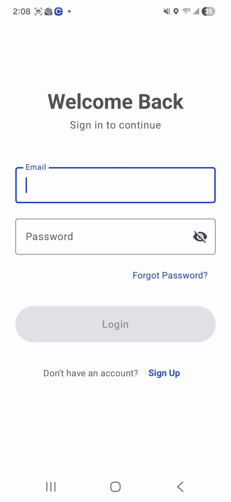
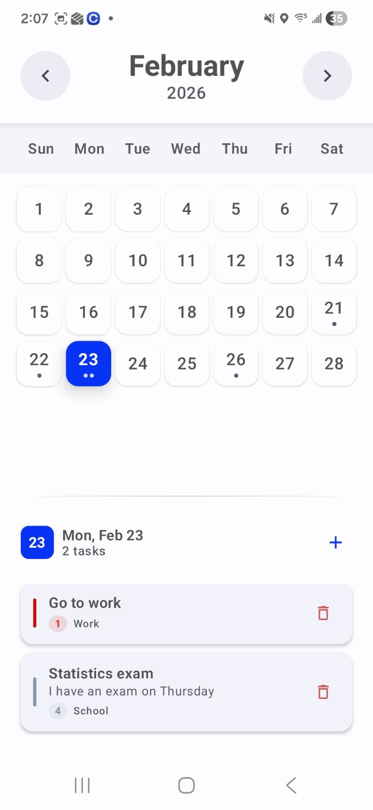
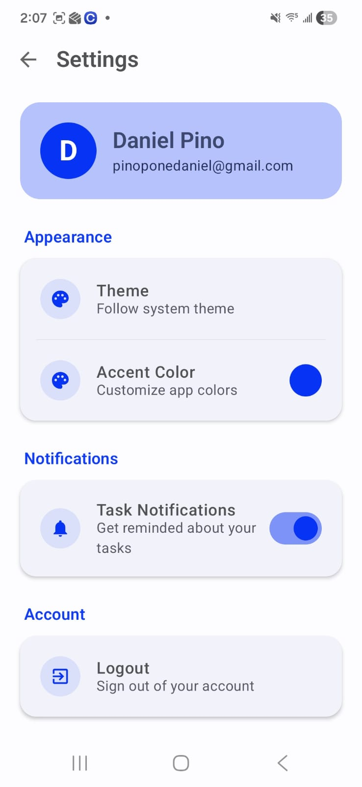
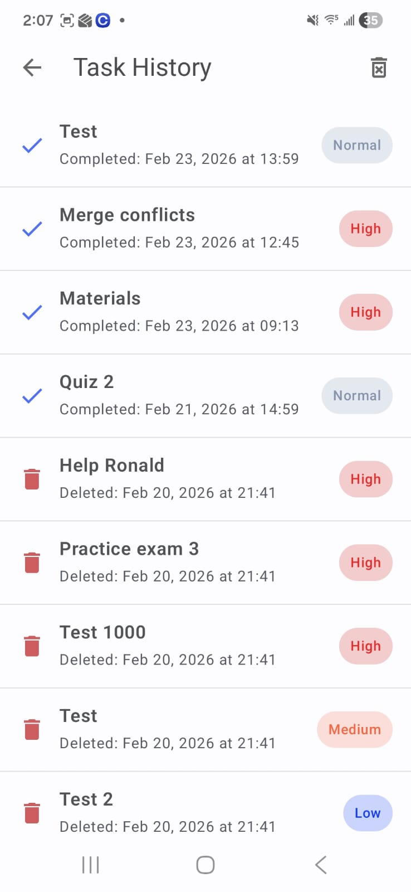

# 📋 Tadu – Smart Task Management App


## 🚀 Overview

**Tadu** is a modern task management Android application designed to help users stay organized and productive.

With Tadu, you can quickly create tasks, set deadlines, choose priority levels, and add locations.

The app supports **cloud synchronization**, **local offline storage**, and **task reminders**.

### ✨ Core Functionalities

- ✅ User authentication (Sign up, Login, Logout, Delete account) using Firebase  
- ☁️ Cloud task storage  
- 📂 Local persistence using Room database  
- 🔔 Task reminders using **<REMINDER_LIBRARY_NAME>**  
- 📅 Deadline and priority management  
- 📍 Location tagging  
- 📤 Calendar integration

---

## 📸 Screenshots

*(Add your real screenshots inside `screenshots/` folder)*

---

### 🔐 Authentication Screens

#### Login / Registration


---

### 🏠 Main Task Dashboard


---

### ✏️ Task Detail & Reminder


---

### 📅 Calendar View



---

### ⚙️ Settings Screen



---

### 📜 Task History



---

## 🏗️ Architecture Highlights

- MVVM (Model-View-ViewModel) pattern  
- Repository abstraction layer  
- Separation of UI, business logic, and data storage  
- Offline-first data design

---

## 🛠️ Tech Stack

- Kotlin / Android SDK  
- Jetpack Compose (if applicable)  
- Firebase Authentication & Cloud Storage  
- Room Persistence Library  
- Notification / Reminder Library (**<REMINDER_LIBRARY_NAME>**)

---

## 📦 Installation

### 1. Clone the Repository

```bash
git clone https://github.com/yourusername/tadu.git
