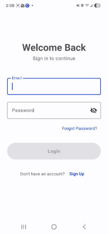
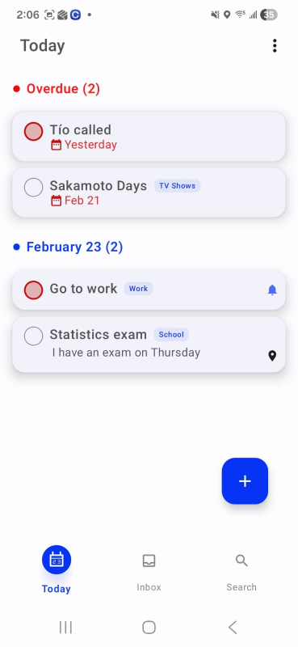

# 📋 Tadu – Task Management App

## 🌟 Description

**Tadu** helps you create tasks in seconds, set deadlines, choose priority levels, and add locations.

The app includes **Firebase account features**, allowing users to:

- ✅ Sign up  
- 🔑 Log in  
- 🚪 Log out  
- 🗑️ Delete account  
- ☁️ Save tasks in the cloud  

For data management, Tadu uses **Room database** for local storage and offline support.

The app integrates **<REMINDER_LIBRARY_NAME>** for notifications and task reminders.

Whether it’s work, school, or daily life, Tadu helps you stay organized and productive.

---

## 📸 Screenshots

### 🔐 Login & Registration
<!-- Replace path with your real screenshot -->


### 🏠 Home / Task List


### ✏️ Create Task


### 📌 Task Details / Reminder View


*(Add or remove screenshots depending on what you have.)*

---

## 🚀 Features

- Create tasks in seconds  
- Set deadlines  
- Priority selection  
- Location tagging  
- Task reminders using **<REMINDER_LIBRARY_NAME>**  
- Firebase authentication  
- Cloud synchronization  
- Local storage with Room database  
- Calendar integration  

---

## 🛠️ Technologies Used

- Kotlin / Java (Android Development)
- Jetpack Compose (if applicable)
- Firebase Authentication & Database
- Room Persistence Library
- <REMINDER_LIBRARY_NAME> Notification Library
- MVVM Architecture (if used)

---

## 🔧 Installation

1. Clone the repository:

```bash
git clone https://github.com/yourusername/tadu.git
