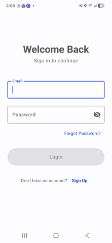
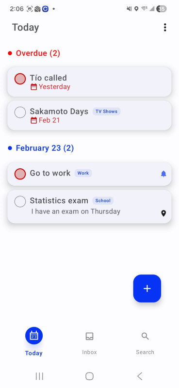
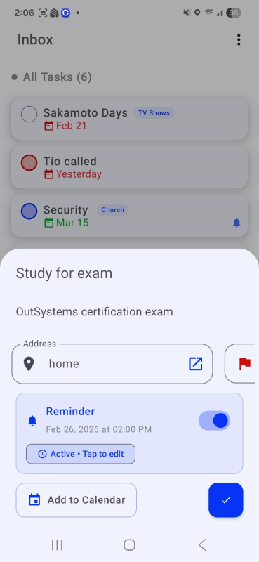
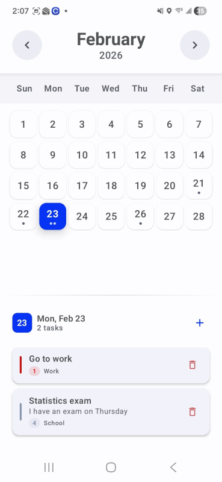
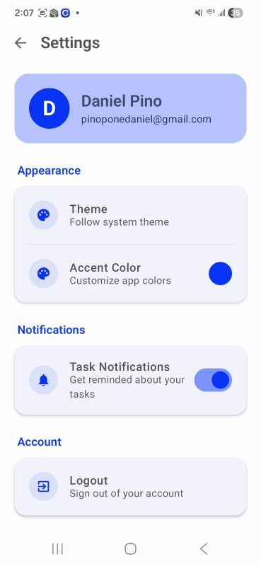
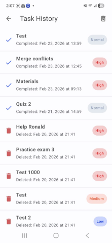

# 📋 Tadu – Smart Task Management App


## 🚀 Overview

**Tadu** is an Android task management app built with Kotlin and Jetpack Compose, following
an MVVM architecture with a repository layer over Firebase (auth + cloud storage) and a local
Room database for offline-first persistence. Tasks support deadlines, priority levels, and
location tags, with scheduled reminders backed by `AlarmManager` and a `BroadcastReceiver`.

### ✨ Core Functionalities

- ✅ User authentication (Sign up, Login, Logout, Delete account) using Firebase  
- ☁️ Cloud task storage  
- 📂 Local persistence using Room database  
- 🔔 Task reminders using BroadcastReceiver, AlarmManager, NotificationManager  
- 📅 Deadline and priority management  
- 📍 Location tagging  
- 📤 Calendar integration

---

## 📸 Screenshots

---

### 🔐 Authentication Screens

#### Login / Registration


---

### 🏠 Main Task Dashboard



---

### ✏️ Task Detail & Reminder



---

### 📅 Calendar View



---

### ⚙️ Settings Screen



---

### 📜 Task History



---

## 🏗️ Architecture Highlights

- MVVM (Model-View-ViewModel) pattern  
- Repository abstraction layer  
- Separation of UI, business logic, and data storage  
- Offline-first data design

---

## 🛠️ Tech Stack

- Kotlin / Android SDK  
- Jetpack Compose  
- Firebase Authentication & Cloud Storage  
- Room Persistence Library  
- AlarmManager + BroadcastReceiver (Task reminders)

---

## 📦 Installation

### 1. Clone the repository

```bash
git clone https://github.com/Daniel-Pino-2000/Tadu.git
```

### 2. Open in Android Studio

Open the cloned folder as an existing project and let Gradle sync.

### 3. Add your own Firebase config

Tadu needs a Firebase project (Authentication + Firestore enabled) to run. Create one in the
[Firebase console](https://console.firebase.google.com/), register an Android app with package
name `com.myapp.tadu`, download the generated `google-services.json`, and place it at
`app/google-services.json`, replacing the one already in this repo.

### 4. Run

Run the `app` configuration on an emulator or device (minSdk per `app/build.gradle.kts`).
